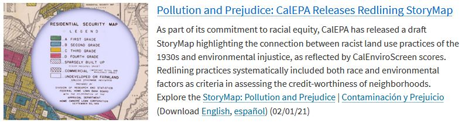
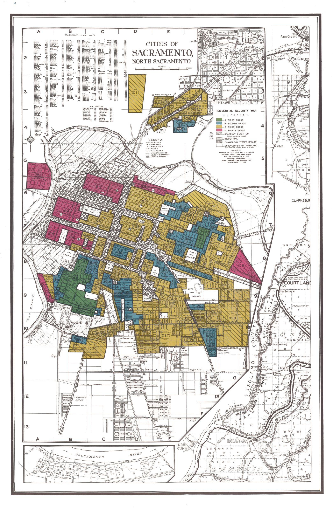
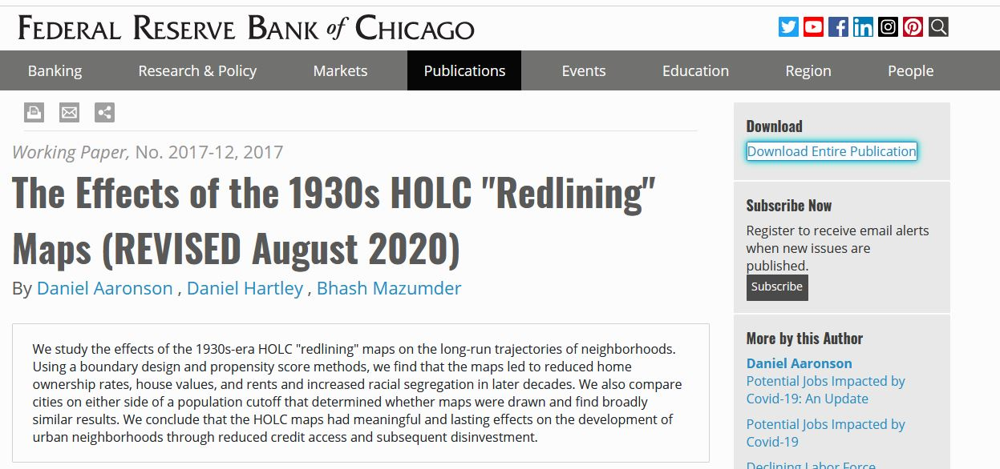

```{r setup-markdown, include=FALSE}

library(icons)

options(htmltools.dir.version = FALSE)
knitr::opts_chunk$set(
  fig.width=9, fig.height=3.5, fig.retina=3,
  out.width = "100%",
  cache = FALSE,
  echo = TRUE,
  message = FALSE, 
  warning = FALSE,
  fig.show = TRUE,
  hiline = TRUE
)
```

```{r xaringan-themer, include=FALSE, warning=FALSE}
library(xaringanthemer)
# style_duo_accent(
#   primary_color = "#1381B0",
#   secondary_color = "#FF961C",
#   inverse_header_color = "#FFFFFF"
# )

style_mono_light(base_color = "#125972", 
                 code_highlight_color = "#c0e8f5",
                 link_color = "#197b9e",
                 title_slide_background_image = 'images/data_center_logo_withText_crop_resize.png',
                 title_slide_background_size = '400px',
                 title_slide_background_position = '95% 95%')
```

```{r xaringan-logo, echo=FALSE}
xaringanExtra::use_tile_view()

xaringanExtra::use_logo(
  image_url = "images/data_center_logo_withText_crop_resize.png",
  width = "280px",
  height = "68px",
  link_url = 'https://github.com/CAWaterBoardDataCenter'
)
```

```{r setup-data, include=FALSE}
knitr::opts_chunk$set(echo = FALSE)

library(sf)
library(ggplot2)
library(here)
library(dplyr)
library(readr)
library(janitor)
library(glue)
library(stringr)

# load data ----
df_departure_scores <- st_read(here('data_processed-analysis',
                                    'departure-area_weighted_scores.gpkg'))

ces_choices <- read_csv(here('data_processed', 
                             'ces_names.csv')) %>% 
    mutate(ces_variable = make_clean_names(name)) %>% #, 'parsed')) %>% 
    slice(8:64) %>%  # rows 8 to 64
    filter(type != 'other?')
```  

## Overview

1. Background
    - CalEPA Team
    - History
    
2. Analysis
    - Data
    - Results
    - Tools
 
3. Presentation Formats
    - Storymap (ESRI ArcGIS)
    - Shiny App
    
4. Considerations / Limitations / Next Steps


---
class: inverse center middle

# Background

---

## Background -- CalEPA’s Racial Equity Team

.pull-left[
#### [Pollution and Prejudice: Redlining and Environmental Injustice in California](https://storymaps.arcgis.com/stories/f167b251809c43778a2f9f040f43d2f5)




Storymap released February 1, 2021

#### `r icons::fontawesome("link")` [bit.ly/pollutionandprejudice](https://bit.ly/pollutionandprejudice)

]

.pull-right[
#### Project Team:
- Greg Gearheart, State Water Resources Control Board
- Beti Girma, State Water Resources Control Board
- Jaimie Huynh, CalRecycle
- Maraid Jimenez, State Water Resources Control Board
- Charles Lee, USEPA Office of Environmental Justice
- Jennifer McGovern, State Water Resources Control Board
- Kevin Olp, Bay Area Air Quality Management District
- Deldi Reyes, California Air Resources Board
- Amy Schwanhausser, former CalEPA Intern
- Walker Wieland, Office of Environmental Health Hazard Assessment
- Angie Ye, former CalEPA Intern
]

---

## Background -- Redlining

--

### Some Standard Definitions: 

- Wikipedia: "the systematic denial of various services or goods by federal government agencies, local governments, or the private sector either directly or through the selective raising of prices" <sup>1</sup>

--

- Google / Oxford Languages: "refuse (a loan or insurance) to someone because they live in an area deemed to be a poor financial risk (example: 'banks have redlined loans to buyers')" <sup>2</sup>

--

<br>
### In the context of this project, "Redlining" refers to a specific, well documented practice...

.footnote[
[1] [Wikipedia](https://en.wikipedia.org/wiki/Redlining)   
[2] [Google / Oxford Languages](https://www.google.com/search?&q=redline+definition)
]

---

## Background -- History

.pull-left[

- 1930s "Residential Security" maps of major cities (population >40,000)

    - Federal government agency --- Home Owners’ Loan Corporation (HOLC)
    
    - Evaluated mortgage lending risk by neighborhood (A-D scale)
    
]

.pull-right[
.center[
```{r out.width = '60%', echo=FALSE}
# local

```
]
]

---

## Background -- History

.pull-left[

- 1930s "Residential Security" maps of major cities (population >40,000)

    - Federal government agency --- Home Owners’ Loan Corporation (HOLC)
    
    - Evaluated mortgage lending risk by neighborhood (A-D scale)
    
    - Explicitly considered racial and ethnic makeup of neighborhoods
    
]

--

.pull-right[
> "***A neighborhood earned a red color if African Americans lived in it***, even if it was a solid middle-class neighborhood of single family homes."

---Richard Rothstein, *[The Color of Law: A Forgotten History of How Our Government Segregated America (2017)](https://www.epi.org/publication/the-color-of-law-a-forgotten-history-of-how-our-government-segregated-america/)*

<!-- quote - Rothstein page 64 -->

]

---

## Background -- History

.pull-left[

- 1930s "Residential Security" maps of major cities (population >40,000)

    - Federal government agency --- Home Owners’ Loan Corporation (HOLC)
    
    - Evaluated mortgage lending risk by neighborhood (A-D Scale)
    
    - Explicitly considered racial and ethnic makeup of neighborhoods
    
    - Resulting disparities in pathways to home ownership, community development, and other economic and social opportunities
    
]

--

.pull-right[
> "Although the HOLC did not always decline to rescue homeowners in neighborhoods colored red on its maps (i.e, redlined neighborhoods), the maps had a huge impact and **<u>put the federal government on record as judging that African Americans, simply because of their race, were poor risks</u>.**"

---Richard Rothstein, *[The Color of Law: A Forgotten History of How Our Government Segregated America (2017)](https://www.epi.org/publication/the-color-of-law-a-forgotten-history-of-how-our-government-segregated-america/)*

<!-- quote - Rothstein page 64 -->

]


---

class: hide_logo

background-image: url(images/holc-scan_sac.jpg)

background-size: contain

<!-- add closeup of legend and holc assessment form -->

---

## Background -- History

.center[
```{r out.width = '70%', echo=FALSE}

```
]

--

> “Our results suggest that the HOLC maps had an economically meaningful and lasting effect on the development of urban neighborhoods through reduced credit access and subsequent disinvestment” 
> 
> --- [Federal Reserve Bank of Chicago, 2020](https://www.chicagofed.org/publications/working-papers/2017/wp2017-12)

---

## Background -- History

#### Zoning (Los Angeles): 

> "a black community became established in the South Central area of the city in the 1940s. The neighborhood had some industry, but its **<u>nonresidential character was more firmly entrenched when the city began a process of 'spot' rezoning</u>** for commercial or industrial facilities. **<u>Automobile junkyards became commonplace</u>** in the African American neighborhood. In 1947, an **<u>electroplating plant explosion</u>** in this newly developing ghetto killed five local residents (as well as fifteen white factory workers) and destroyed more than one hundred homes.
>
> ---Richard Rothstein, *[The Color of Law: A Forgotten History of How Our Government Segregated America (2017)](https://www.epi.org/publication/the-color-of-law-a-forgotten-history-of-how-our-government-segregated-america/)*

<!-- quote - Rothstein page 55 -->

---

## Background -- History

#### Zoning & Redlining: 

> "when the Federal Housing Administration (FHA) developed insured amortized mortgage as a way to promote homeownership nationwide, **<u>these zoning practices rendered African Americans ineligible for such mortgages</u>** because banks and the FHA considered the existence of nearby rooming houses, commercial development, or industry to create risk to the property value of single-family areas. **<u>Without such mortgages, the effective cost of African American housing was greater than that of similar housing in white neighborhoods, leaving owners with fewer resources for upkeep</u>**. African American homes were then more likely to deteriorate, reinforcing their neighborhoods' slum conditions."
>

<!-- quote - Rothstein page 50 -->

--

> "zoning... attempted to protect white neighborhoods from deterioration by ensuring that few industrial or environmentally unsafe businesses could locate in them. Prohibited in this fashion, **<u>polluting industry had no option but to locate near African American residences</u>**."

<!-- quote - Rothstein page 56-57 -->

---Richard Rothstein, *[The Color of Law: A Forgotten History of How Our Government Segregated America (2017)](https://www.epi.org/publication/the-color-of-law-a-forgotten-history-of-how-our-government-segregated-america/)*


---

class: inverse center middle

# Analysis

---
class: center middle

## Results

<!-- fig.width = 10, fig.height = 5 -->

```{r boxplot}

# generic CES departure scores boxplot function
fn_departures_boxplot <- function(plot_var) {
    measure_name <- ces_choices %>% filter(ces_variable == plot_var) %>% pull(name)
    ggplot(data = df_departure_scores, 
                             mapping = aes(x = holc_grade, 
                                           y = !!as.name(plot_var))) +
    geom_boxplot(aes(fill = holc_grade), notch = FALSE, outlier.shape = NA) + # notch = FALSE
    scale_fill_manual(values = alpha(c('green', 'blue', 'yellow', 'red'), 0.6), 
                      labels = c('A (Best)', 'B (Desirable)', 'C (Declining)', 'D (Hazardous)')) +
    geom_jitter(color='black', size=0.6, alpha=0.5, width = 0.2) +
    scale_x_discrete(limits = rev(levels(factor(df_departure_scores$holc_grade)))) +
    coord_flip() + # ylim = c(axis_min, axis_max)) +
    # NOTE: if not flipping the coordinates, use coord_cartesian(ylim = c(axis_min, axis_max))
    # theme(legend.position = "none") +
    labs(x = 'HOLC Grade', 
         y = glue('{measure_name} Relative to Respective City-Wide Average Score (Increasing Disadvantage\u2192)'),
         title = glue('{measure_name} for Neighborhoods in California Cities Assessed by the HOLC in the 1930s'), # Departure from Citywide Average, by HOLC Grade'),
         subtitle = 'Each point represents a neighborhood in the HOLC maps',
         caption = glue('Note: Higher {str_replace(measure_name, "Score", "score")}s indicate greater pollution burden and/or population vulnerability'),
         fill = 'HOLC Grade') +
    geom_blank()
}

plot_box_ces <- fn_departures_boxplot(plot_var = 'ces_3_score')
    ggsave(filename = here('_storymap', 'storymap_images', 'box_ces_score.png'), 
           plot = plot_box_ces, width = 10, height = 4.5, dpi = 125)
    
# display the plot
plot_box_ces
```


---
class: inverse center middle

# Presentation Formats

---

## Presentation Formats

### Storymap (ESRI / ArcGIS)

Pollution and Prejudice: Redlining and Environmental Injustice in California

#### - Detailed history / context

#### - High level overview of analysis / results

#### [Link](https://storymaps.arcgis.com/stories/f167b251809c43778a2f9f040f43d2f5)

### Shiny App (R / RStudio)

#### - Details about the analysis / results

#### - Tool to view CalEPA regulory data

#### - Other tools / features to explore in context?

???
full link at: 
https://storymaps.arcgis.com/stories/f167b251809c43778a2f9f040f43d2f5

---
class: inverse center middle

# Considerations / Limitations / Next Steps

---

## Considerations

---

# Thanks!

.pull-left[
### Slides / Contact
#### `r icons::fontawesome("link")` [bit.ly/redline-2021-03](https://bit.ly/redline-2021-03)
#### `r icons::fontawesome("github")` [github.com/daltare](https://github.com/daltare/)
#### `r icons::fontawesome("envelope")` [david.altare@waterboards.ca.gov](mailto: david.altare@waterboards.ca.gov)


### Waterboards Data Center Info:
#### `r icons::fontawesome("github")` [github.com/CAWaterBoardDataCenter](https://github.com/CAWaterBoardDataCenter)
#### `r icons::fontawesome("envelope")` [waterdata@waterboards.ca.gov](mailto: waterdata@waterboards.ca.gov)
]

.pull-right[

]
