```{r setup-markdown, include=FALSE}

library(icons)

options(htmltools.dir.version = FALSE)
knitr::opts_chunk$set(
  fig.retina=3, # fig.width=9, fig.height=3.5, 
  out.width = "100%",
  cache = FALSE,
  echo = TRUE,
  message = FALSE, 
  warning = FALSE,
  fig.show = TRUE,
  hiline = TRUE
)
```

```{r xaringan-themer, include=FALSE, warning=FALSE}
library(xaringanthemer)
# style_duo_accent(
#   primary_color = "#1381B0",
#   secondary_color = "#FF961C",
#   inverse_header_color = "#FFFFFF"
# )

style_mono_light(base_color = "#125972", 
                 code_highlight_color = "#c0e8f5",
                 link_color = "#197b9e",
                 title_slide_background_image = 'images/data_center_logo_withText_crop_resize.png',
                 title_slide_background_size = '350px',
                 title_slide_background_position = '98% 93%')
```

```{r xaringan-logo, echo=FALSE}
xaringanExtra::use_tile_view()

xaringanExtra::use_logo(
  image_url = "images/data_center_logo_withText_crop_resize.png",
  width = "280px",
  height = "68px",
  link_url = 'https://github.com/CAWaterBoardDataCenter'
)
```

```{r setup-data, include=FALSE}
# knitr::opts_chunk$set(echo = FALSE)
# 
# library(sf)
# library(ggplot2)
# library(dplyr)
# library(here)
# library(glue)
# library(readr)
# library(janitor)
# library(tidyr)
# library(stringr)
# library(tmap)
# library(tmaptools)
# library(ceramic)
# library(patchwork)
# library(forcats)
# 
# # load data ----
# df_departure_scores <- st_read(here('data_processed-analysis',
#                                     'departure-area_weighted_scores.gpkg'))
# 
# df_raw_scores <- st_read(here('data_processed-analysis',
#                               'holc_area_weighted_scores.gpkg'))
# 
# # departure scores using the nearest centroid approach
# df_departure_scores_centroid <- st_read(here('data_processed-analysis', 
#                                              'departure-centroid_scores.gpkg'))
# df_raw_scores_centroid <- st_read(here('data_processed-analysis', 
#                                        'holc_centroid_scores.gpkg'))
# 
# ces_choices <- read_csv(here('data_processed', 
#                              'ces_names.csv')) %>% 
#     mutate(ces_variable = make_clean_names(name)) %>% #, 'parsed')) %>% 
#     slice(8:64) %>%  # rows 8 to 64
#     filter(type != 'other?')
```  

### Overview

1. Background / Context
    - CalEPA Team
    - Definitions & History
    
2. Analysis
    - Data
    - Results
    
3. Tools & Methods    
 
4. Presentation Formats
    - Storymap website
    - Shiny App

<!-- 5. Considerations, Limitations, & Next Steps -->

---
class: center middle

### Extended version of this presentation (recorded March 18, 2021):

### https://www.youtube.com/watch?v=fa12Wf-Ugx4

---
class: inverse center middle

# Background / Context

---

### Background — CalEPA Racial Equity Team

.pull-left[
#### [Pollution and Prejudice: Redlining and Environmental Injustice in California](https://storymaps.arcgis.com/stories/f167b251809c43778a2f9f040f43d2f5)


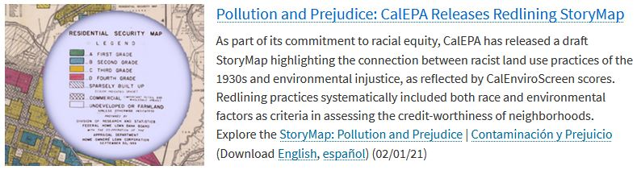

Storymap released February 1, 2021 

#### `r icons::fontawesome("link")` [bit.ly/pollutionandprejudice](https://bit.ly/pollutionandprejudice)

]

--

.pull-right[
#### Project Team:
- Greg Gearheart, State Water Resources Control Board
- Beti Girma, State Water Resources Control Board
- Jaimie Huynh, CalRecycle
- Maraid Jimenez, State Water Resources Control Board
- Charles Lee, USEPA Office of Environmental Justice
- Jennifer McGovern, State Water Resources Control Board
- Kevin Olp, Bay Area Air Quality Management District
- Deldi Reyes, California Air Resources Board
- Amy Schwanhausser, former CalEPA Intern
- Walker Wieland, Office of Environmental Health Hazard Assessment
- Angie Ye, former CalEPA Intern
]

---

### Background — History

.pull-left[

- 1930s "Residential Security" maps of major cities across the country (population >40,000), including 8 in California:

    - Fresno
    
    - Los Angeles
    
    - Oakland
    
    - Sacramento
    
    - San Diego
    
    - San Francisco
    
    - San Jose
    
    - Stockton
    
]

.pull-right[
.center[
```{r out.width = '70%', echo=FALSE}
# local
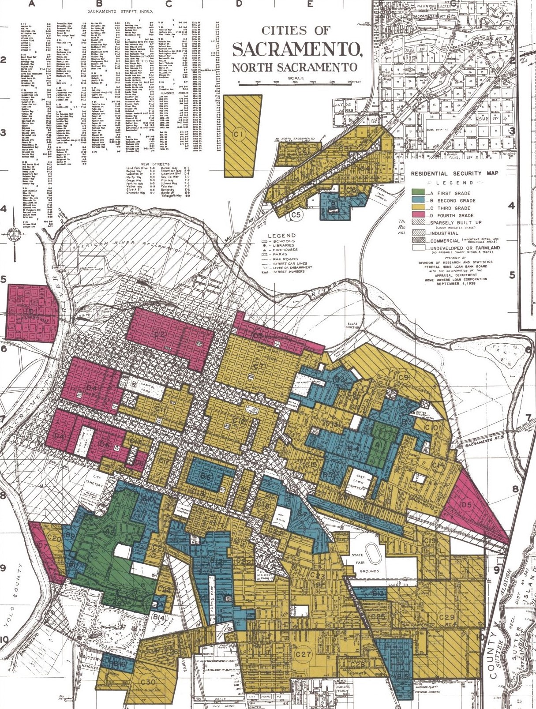
```
]
]

---

### Background — History

.pull-left[

- 1930s "Residential Security" maps of major cities across the country (population >40,000)

    - Created by a federal government agency — Home Owners’ Loan Corporation (HOLC)
    
    - Evaluated mortgage lending risk by neighborhood — A (green) to D (red) scale
 
    - Explicitly considered racial and ethnic makeup of neighborhoods
    
    - Influenced disparities in pathways to home ownership, community development, and other economic and social opportunities
    
]

--

.pull-right[
> "**<u>A neighborhood earned a red color if African Americans lived in it</u>**, even if it was a solid middle-class neighborhood of single family homes."

> "Although the HOLC did not always decline to rescue homeowners in neighborhoods colored red on its maps (i.e, redlined neighborhoods), the maps had a huge impact and **<u>put the federal government on record as judging that African Americans, simply because of their race, were poor risks</u>.**"

---Richard Rothstein, *[The Color of Law: A Forgotten History of How Our Government Segregated America (2017)](https://www.epi.org/publication/the-color-of-law-a-forgotten-history-of-how-our-government-segregated-america/)*

]

---

class: hide_logo

background-image: url(images/holc-scan_sac_cropped.jpg)

background-size: contain

.footnote[
Image Source: <br>[Mapping Inequality](https://dsl.richmond.edu/panorama/redlining/#loc=&text=downloads)
]

--

<br>
.right[
```{r out.width = '30%', echo=FALSE}
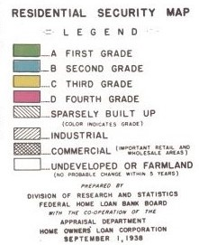
```
]

---

class: hide_logo

background-image: url(images/sac_form_D4.jpg)

background-size: contain

--

<br>
.center[
```{r out.width = '70%', echo=FALSE}
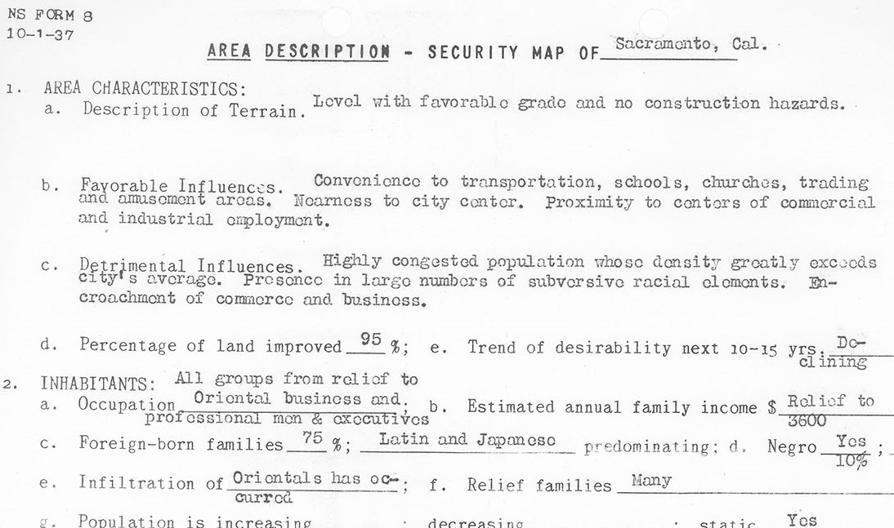
```
]

---

class: inverse center middle

# Analysis

---

### Question

- Is there a relationship between historical Redlining and present-day environmental conditions / pollution burdens in California?

--

- Resources: 

    - Digitized HOLC maps (1930s Redlining)
    - CalEnviroScreen 3.0 (current environmental/public health/socioeconomic conditions)

---

### Digitized Redlining Maps

.center[
```{r out.width = '70%', echo=FALSE}
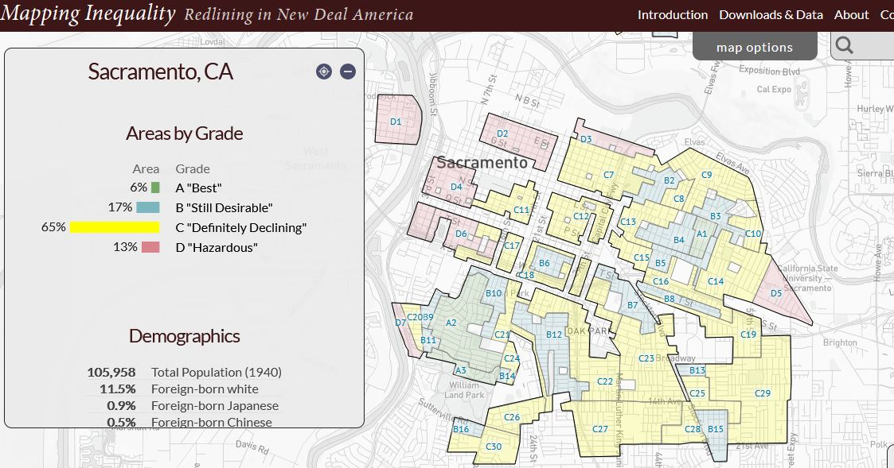
```
]

.footnote[Robert K. Nelson, LaDale Winling, Richard Marciano, Nathan Connolly, et al., “Mapping Inequality,” American Panorama, ed. Robert K. Nelson and Edward L. Ayers. https://dsl.richmond.edu/panorama/redlining/]

---

### Digitized Redlining Maps

.center[
```{r out.width = '65%', echo=FALSE}
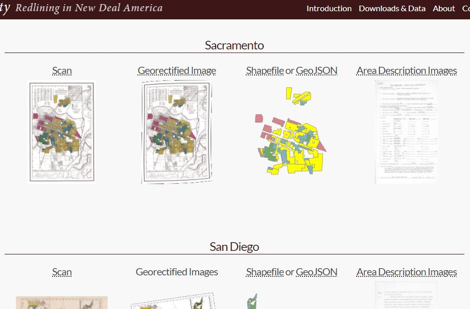
```
]

.footnote[http://dsl.richmond.edu/panorama/redlining/#text=downloads]

---

### CalEnviroScreen 3.0 

.pull-left[

- broad indicator of present-day environmental / public health conditions across the state

- mapping tool to identify California communities 
    - most affected by different sources of pollution
    - most vulnerable to the effects of pollution

- gives a numeric score for each census tract in the state based on environmental, health, and socioeconomic data 

]

.pull-right[
.center[
```{r out.width = '80%', echo=FALSE}
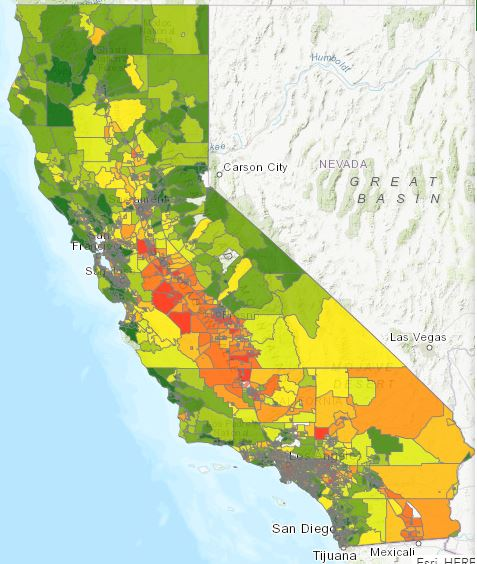
```
]
]

---

### CalEnviroScreen 3.0

.pull-left[
.center[
```{r out.width = '100%', echo=FALSE}
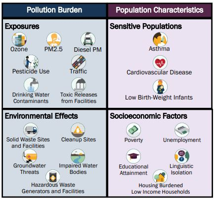
```
]
]

--

.pull-right[
<br>
<br>
.center[
```{r out.width = '100%', echo=FALSE}
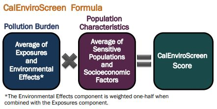
```
]
]

---

### Combining Redline Maps & CalEnviroScreen Data

.center[
```{r out.width = '80%', echo=FALSE}
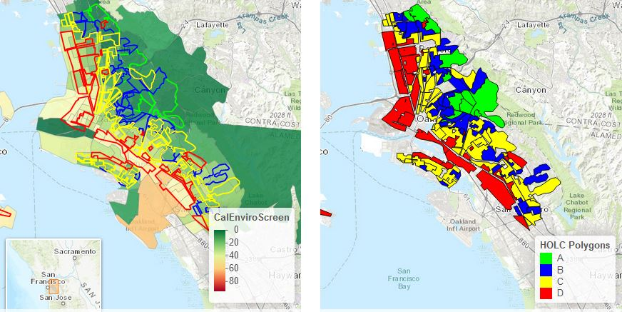
```
]

---

### Translating CalEnviroScreen Scores to Redline Maps

#### For quantitative comparisons, translate CalEnviroScreen scores from census tracts to neighborhoods in 1930s Redline maps

.center[
```{r out.width = '110%', echo=FALSE}
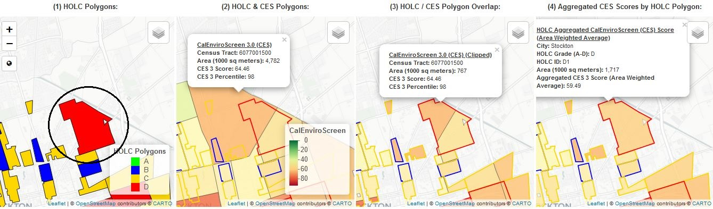
```
]

---

### Translating CalEnviroScreen Scores to Redline Maps

#### Multiple methods for translating CalEnviroScreen scores from census tracts to neighborhoods in 1930s Redline maps

.center[
```{r out.width = '110%', echo=FALSE}
knitr::include_graphics("images/nearest_centroid_stockton.jpg")
```
]


---

### Translating CalEnviroScreen Scores to Redline Maps

#### Comparing Methods

.center[
```{r out.width = '60%', echo=FALSE}
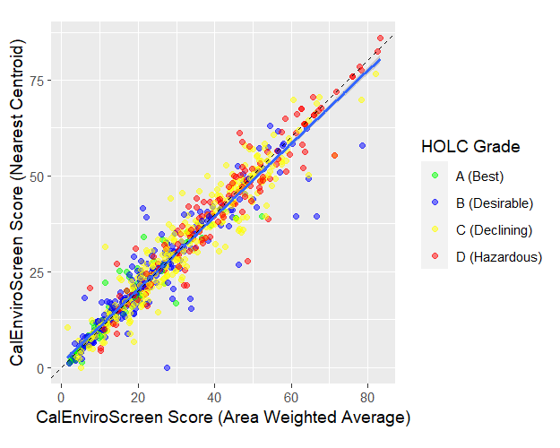
```
]

---

### Results — CalEnviroScreen Scores by City & Grade

.center[
```{r out.width = '100%', echo=FALSE}
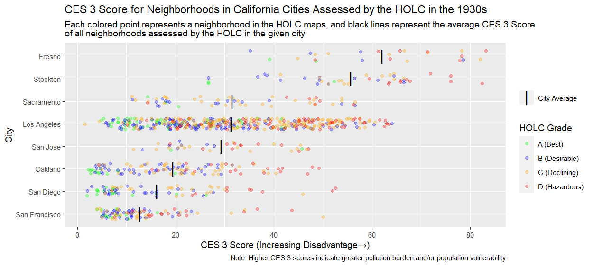
```
]

---

### Results — CalEnviroScreen Scores by City & Grade

.center[
```{r out.width = '100%', echo=FALSE}
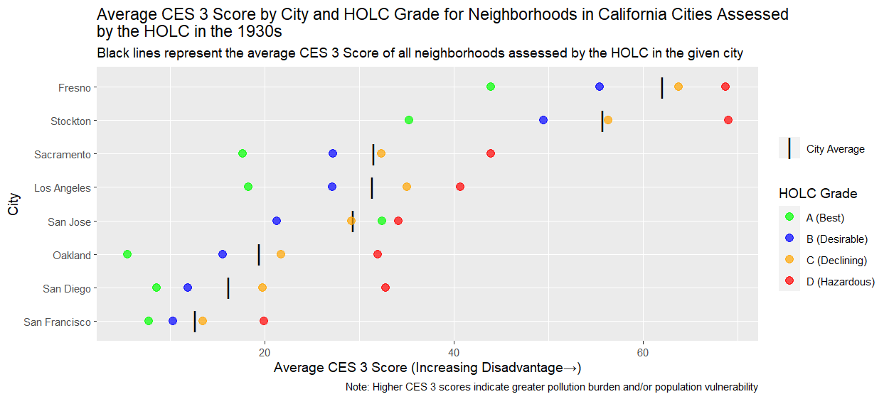
```
]

---

### Results — Adjusted CalEnviroScreen Scores

.footnote[*Adjusted Score = [Neighborhood CalEnviroScreen Score] - [Citywide Average CalEnvrioScreen Score]
]

.center[
```{r out.width = '100%', echo=FALSE}
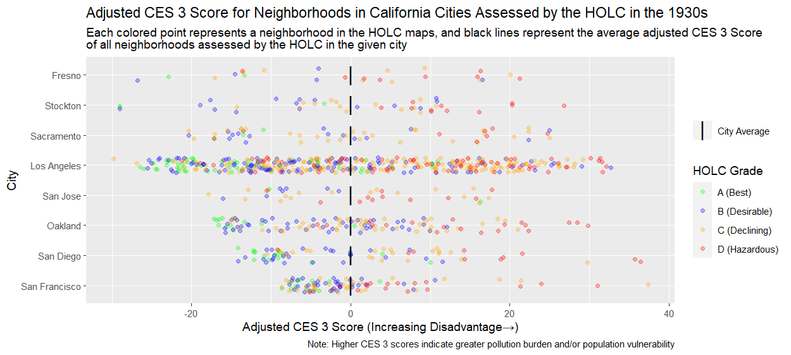
```
]

---

### Results — Adjusted CalEnviroScreen Scores

.center[
```{r out.width = '100%', echo=FALSE}
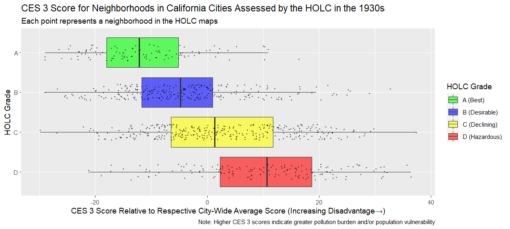
```
]

---

### Results — 20 Indicators

.center[
```{r out.width = '100%', echo=FALSE}
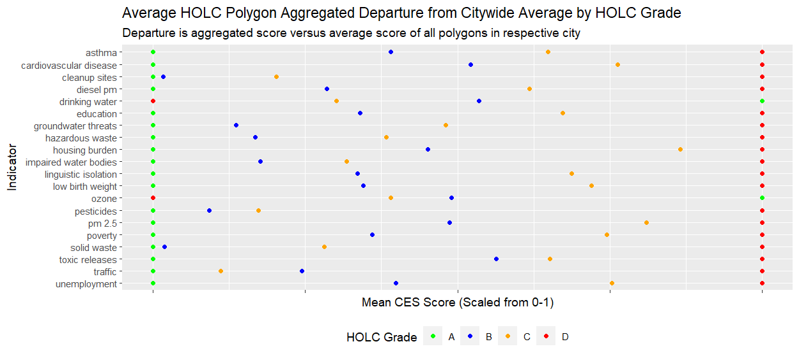
```
]

---

### Results — Present-Day Demographics

.center[
```{r out.width = '100%', echo=FALSE}
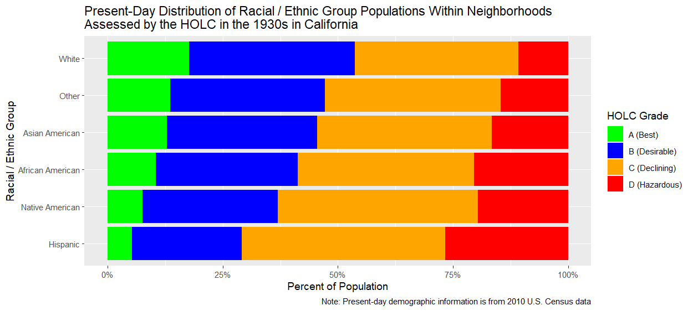
```
]

---
class: inverse center middle

# Tools & Methods

---

### Tools & Methods

#### R (programming language) & RStudio used for:
- data access
- cleaning and reformatting data
- basic analysis and visualization
- geospatial data processing and analysis
- reporting 
    - reports / presentations — [Rmarkdown](https://rmarkdown.rstudio.com/)
    - interactive tools — [Shiny](https://shiny.rstudio.com/) & [shinyapps.io](https://www.shinyapps.io/)
    
`r icons::fontawesome("link")` [r-project.org](https://www.r-project.org/)

--

#### Code and data on GitHub  `r icons::fontawesome("github")`
- transparency
- reuse
- collaboration

`r icons::fontawesome("link")` [github.com/daltare/Redline-Mapping](https://github.com/daltare/Redline-Mapping)

---
class: inverse center middle

# Presentation Formats

---

### Presentation Formats

#### 1 - Storymap (ESRI / ArcGIS) — Pollution and Prejudice: Redlining and Environmental Injustice in California 

- Detailed history / context

- Interactive Maps

- High level overview of analysis / results

`r icons::fontawesome("link")` [bit.ly/pollutionandprejudice](https://bit.ly/pollutionandprejudice)

#### 2 - Shiny App (R / RStudio)

- Interactive tool to explore analysis / results in detail

- Tool to view CalEPA regulatory data in context of redlined areas (may add other tools / features to explore other data?)

`r icons::fontawesome("link")` [cawaterdatadive.shinyapps.io/Redline-Mapping/](https://cawaterdatadive.shinyapps.io/Redline-Mapping/)

???
storymap - full link at: 
https://storymaps.arcgis.com/stories/f167b251809c43778a2f9f040f43d2f5

---

### Conclusion & Next Steps

#### Informs and supports our mission to ensure equitable access to clean water for all Californians

#### Across the state, people of color are significantly over-represented in the census tracts with the highest pollution burden / vulnerability: 
.center[
```{r out.width = '60%', echo=FALSE}
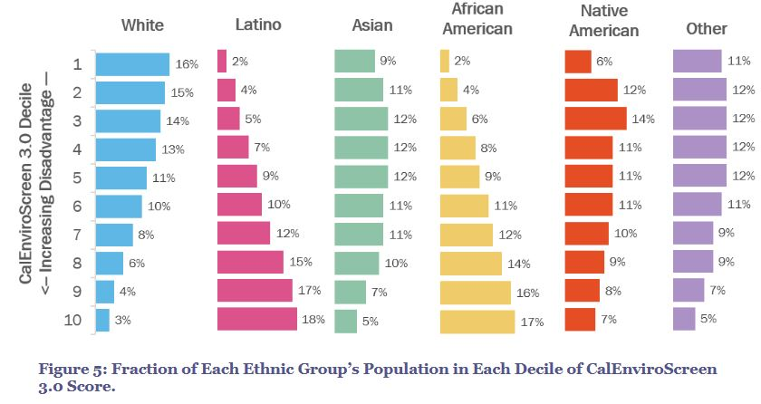
```
]


.footnote[
[Analysis of Race/Ethnicity, Age, and CalEnviroScreen 3.0 Scores](https://oehha.ca.gov/media/downloads/calenviroscreen/document-calenviroscreen/raceageces3analysis.pdf), Office of Environmental Health Hazard Assessment, California Environmental Protection Agency, June 2018
]

---
class: middle center

# Thanks!

### Slides / Contact
#### `r icons::fontawesome("link")` [https://bit.ly/redline-GIS-RT](https://bit.ly/redline-GIS-RT)
#### `r icons::fontawesome("github")` [github.com/daltare](https://github.com/daltare/)
#### `r icons::fontawesome("envelope")` [david.altare@waterboards.ca.gov](mailto: david.altare@waterboards.ca.gov)


### Waterboards Data Center
#### `r icons::fontawesome("github")` [github.com/CAWaterBoardDataCenter](https://github.com/CAWaterBoardDataCenter)
#### `r icons::fontawesome("envelope")` [waterdata@waterboards.ca.gov](mailto: waterdata@waterboards.ca.gov)
