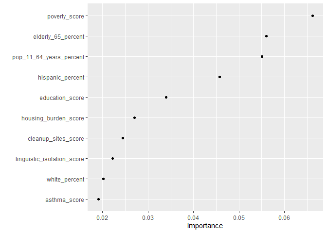
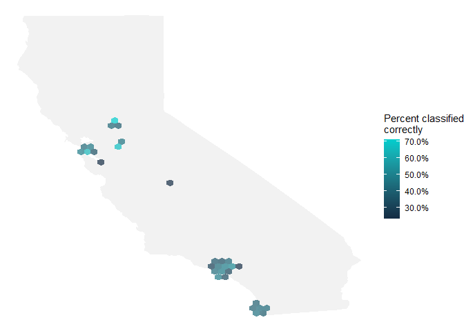

Build Model To Predict HOLC Grade Based On CES Scores
================
Dave
2020-08-20

  - [Intro - Random Forest Model For Multi-Class
    Classification](#intro---random-forest-model-for-multi-class-classification)
  - [Import Data](#import-data)
  - [Build a Model](#build-a-model)
  - [Explore results](#explore-results)

## Intro - Random Forest Model For Multi-Class Classification

Reference: <https://juliasilge.com/blog/multinomial-volcano-eruptions/>

## Import Data

``` r
library(sf)

df_departure_scores <- st_read(here('data_processed-analysis', 
                                    'departure-area_weighted_scores.gpkg'))
```

    ## Reading layer `departure-area_weighted_scores' from data source `C:\David\Redline-Mapping\data_processed-analysis\departure-area_weighted_scores.gpkg' using driver `GPKG'
    ## Simple feature collection with 868 features and 62 fields
    ## geometry type:  MULTIPOLYGON
    ## dimension:      XY
    ## bbox:           xmin: -220760 ymin: -590129.8 xmax: 279880.3 ymax: 68016.7
    ## projected CRS:  NAD83 / California Albers

``` r
glimpse(df_departure_scores)
```

    ## Rows: 868
    ## Columns: 63
    ## $ holc_city                                   <chr> "Fresno", "Fresno", "Fr...
    ## $ holc_grade                                  <chr> "A", "A", "B", "B", "B"...
    ## $ holc_id                                     <chr> "A1", "A2", "B1", "B2",...
    ## $ holc_id_2                                   <chr> "A1", "A2", "B1", "B2",...
    ## $ score_type                                  <chr> "departure (area weight...
    ## $ ces_3_score                                 <dbl> -22.8868632, -13.362444...
    ## $ ces_3_percentile                            <dbl> -18.213289, -5.929916, ...
    ## $ ozone_score                                 <dbl> -0.0015948554, -0.00159...
    ## $ ozone_percentile                            <dbl> -3.745385, -3.745385, -...
    ## $ pm_2_5_score                                <dbl> 0.006902956, 0.00690295...
    ## $ pm_2_5_percentile                           <dbl> 0.04347966, 0.04347966,...
    ## $ diesel_pm_score                             <dbl> -0.8678885, 8.5624553, ...
    ## $ diesel_pm_percentile                        <dbl> 1.85833458, 2.67722611,...
    ## $ drinking_water_score                        <dbl> -6.669633, -6.669633, -...
    ## $ drinking_water_percentile                   <dbl> -0.5078153, -0.5078153,...
    ## $ pesticides_score                            <dbl> -48.0874948, -48.087494...
    ## $ pesticides_percentile                       <dbl> -25.096348, -25.096348,...
    ## $ toxic_releases_score                        <dbl> -18652.034, -17847.252,...
    ## $ toxic_releases_percentile                   <dbl> -8.3833495, -5.2022410,...
    ## $ traffic_score                               <dbl> -111.55689, -265.46907,...
    ## $ traffic_percentile                          <dbl> -8.5208009, -23.7807534...
    ## $ cleanup_sites_score                         <dbl> -3.1248736, -4.9248736,...
    ## $ cleanup_sites_percentile                    <dbl> 1.344035, -9.655965, -3...
    ## $ groundwater_threats_score                   <dbl> -5.5409884, -4.3787714,...
    ## $ groundwater_threats_percentile              <dbl> -18.6760848, -14.140566...
    ## $ hazardous_waste_score                       <dbl> -0.171808490, -0.099919...
    ## $ hazardous_waste_percentile                  <dbl> -23.1632899, 0.8601305,...
    ## $ impaired_water_bodies_score                 <dbl> 0.000000, 0.000000, 0.0...
    ## $ impaired_water_bodies_percentile            <dbl> 0.00000, 0.00000, 0.000...
    ## $ solid_waste_score                           <dbl> -1.55855291, -1.0585529...
    ## $ solid_waste_percentile                      <dbl> -26.0048257, -6.0048257...
    ## $ pollution_burden_group                      <dbl> -8.7006120, -7.0775596,...
    ## $ pollution_burden_group_score                <dbl> -1.07193064, -0.8689407...
    ## $ pollution_burden_group_percentile           <dbl> -12.6032660, -8.8710253...
    ## $ asthma_score                                <dbl> -17.3864238, 12.4828266...
    ## $ asthma_percentile                           <dbl> -3.2134486, 4.3298769, ...
    ## $ low_birth_weight_score                      <dbl> -0.45921176, 0.59527692...
    ## $ low_birth_weight_percentile                 <dbl> 2.5157805, 12.6968890, ...
    ## $ cardiovascular_disease_score                <dbl> -3.3331517, -1.4055092,...
    ## $ cardiovascular_disease_percentile           <dbl> -20.088346, 0.541630, -...
    ## $ education_score                             <dbl> -26.0349628, -28.464158...
    ## $ education_percentile                        <dbl> -32.842322, -38.464491,...
    ## $ linguistic_isolation_score                  <dbl> -12.6066075, -10.794819...
    ## $ linguistic_isolation_percentile             <dbl> -52.264229, -37.516374,...
    ## $ poverty_score                               <dbl> -29.500000, -15.317408,...
    ## $ poverty_percentile                          <dbl> -28.830866, -11.090818,...
    ## $ unemployment_score                          <dbl> -7.58881180, 2.82687941...
    ## $ unemployment_percentile                     <dbl> -29.7713199, 11.0787989...
    ## $ housing_burden_score                        <dbl> -8.9869359, -10.6500111...
    ## $ housing_burden_percentile                   <dbl> -26.789101, -30.757874,...
    ## $ population_characteristics_group            <dbl> -20.8188068, -8.0873153...
    ## $ population_characteristics_group_score      <dbl> -2.15733473, -0.8426976...
    ## $ population_characteristics_group_percentile <dbl> -24.444023, -6.066192, ...
    ## $ children_10_percent                         <dbl> -5.26362366, -5.0439514...
    ## $ pop_11_64_years_percent                     <dbl> 1.92160918, 4.51372478,...
    ## $ elderly_65_percent                          <dbl> 3.3868389, 0.5750511, 2...
    ## $ hispanic_percent                            <dbl> -23.7553830, -12.127123...
    ## $ white_percent                               <dbl> 31.425898, 19.647287, 2...
    ## $ african_american_percent                    <dbl> -4.5178245, -3.1517042,...
    ## $ native_american_percent                     <dbl> -0.02207375, 0.45981540...
    ## $ asian_american_percent                      <dbl> -3.9136614, -5.1845434,...
    ## $ other_percent                               <dbl> 0.7445829, 0.5178070, 0...
    ## $ geom                                        <MULTIPOLYGON [m]> MULTIPOLYG...

``` r
range(df_departure_scores$ces_3_score)
```

    ## [1] -29.85058  37.41357

## Build a Model

Create a dataset for modeling, by selecting the relevant predictor and
outcome variables, and converting character fields to factor.

``` r
library(tidymodels)

holc_df <- df_departure_scores %>% 
    st_drop_geometry() %>% 
    mutate(holc_city = factor(holc_city),
           holc_grade = factor(holc_grade)) %>% 
    select(-holc_id, 
           -score_type, 
           -ces_3_score,
           -pollution_burden_group, 
           -pollution_burden_group_score, 
           -pollution_burden_group_percentile,
           -population_characteristics_group,
           -population_characteristics_group_score,
           -population_characteristics_group_percentile) %>% 
    select(-contains('percentile'))

glimpse(holc_df)
```

    ## Rows: 868
    ## Columns: 32
    ## $ holc_city                    <fct> Fresno, Fresno, Fresno, Fresno, Fresno...
    ## $ holc_grade                   <fct> A, A, B, B, B, B, B, C, C, C, C, C, C,...
    ## $ holc_id_2                    <chr> "A1", "A2", "B1", "B2", "B3", "B4", "B...
    ## $ ozone_score                  <dbl> -0.0015948554, -0.0015948554, -0.00159...
    ## $ pm_2_5_score                 <dbl> 0.006902956, 0.006902956, 0.006902956,...
    ## $ diesel_pm_score              <dbl> -0.8678885, 8.5624553, -5.2467139, 5.8...
    ## $ drinking_water_score         <dbl> -6.669633, -6.669633, -6.669633, -6.39...
    ## $ pesticides_score             <dbl> -48.0874948, -48.0874948, -48.0874948,...
    ## $ toxic_releases_score         <dbl> -18652.034, -17847.252, -18990.853, -1...
    ## $ traffic_score                <dbl> -111.55689, -265.46907, -99.77108, -12...
    ## $ cleanup_sites_score          <dbl> -3.1248736, -4.9248736, -7.1210207, -4...
    ## $ groundwater_threats_score    <dbl> -5.5409884, -4.3787714, -7.1595070, -5...
    ## $ hazardous_waste_score        <dbl> -0.171808490, -0.099919338, -0.2099193...
    ## $ impaired_water_bodies_score  <dbl> 0.000000, 0.000000, 0.000000, 0.000000...
    ## $ solid_waste_score            <dbl> -1.55855291, -1.05855291, -1.55855291,...
    ## $ asthma_score                 <dbl> -17.3864238, 12.4828266, -30.8942690, ...
    ## $ low_birth_weight_score       <dbl> -0.45921176, 0.59527692, -2.33916061, ...
    ## $ cardiovascular_disease_score <dbl> -3.3331517, -1.4055092, -4.6320058, -2...
    ## $ education_score              <dbl> -26.0349628, -28.4641583, -16.3202795,...
    ## $ linguistic_isolation_score   <dbl> -12.6066075, -10.7948197, -8.9246141, ...
    ## $ poverty_score                <dbl> -29.500000, -15.317408, -8.707796, -17...
    ## $ unemployment_score           <dbl> -7.58881180, 2.82687941, -7.31541141, ...
    ## $ housing_burden_score         <dbl> -8.9869359, -10.6500111, -6.3792196, -...
    ## $ children_10_percent          <dbl> -5.26362366, -5.04395146, -1.89109057,...
    ## $ pop_11_64_years_percent      <dbl> 1.92160918, 4.51372478, -0.88464310, 3...
    ## $ elderly_65_percent           <dbl> 3.3868389, 0.5750511, 2.8205581, 0.911...
    ## $ hispanic_percent             <dbl> -23.7553830, -12.1271233, -14.5460721,...
    ## $ white_percent                <dbl> 31.425898, 19.647287, 20.751843, 19.20...
    ## $ african_american_percent     <dbl> -4.5178245, -3.1517042, -3.4391221, -2...
    ## $ native_american_percent      <dbl> -0.02207375, 0.45981540, -0.01812812, ...
    ## $ asian_american_percent       <dbl> -3.9136614, -5.1845434, -3.1537377, -3...
    ## $ other_percent                <dbl> 0.7445829, 0.5178070, 0.4231141, 0.790...

``` r
holc_df %>%
  count(holc_grade, sort = TRUE)
```

    ##   holc_grade   n
    ## 1          C 331
    ## 2          B 273
    ## 3          D 155
    ## 4          A 109

Instead of splitting this small-ish dataset into training and testing
data, let’s create a set of bootstrap resamples.

``` r
holc_boot <- bootstraps(holc_df)

holc_boot
```

    ## # Bootstrap sampling 
    ## # A tibble: 25 x 2
    ##    splits            id         
    ##    <list>            <chr>      
    ##  1 <split [868/326]> Bootstrap01
    ##  2 <split [868/313]> Bootstrap02
    ##  3 <split [868/315]> Bootstrap03
    ##  4 <split [868/316]> Bootstrap04
    ##  5 <split [868/309]> Bootstrap05
    ##  6 <split [868/336]> Bootstrap06
    ##  7 <split [868/325]> Bootstrap07
    ##  8 <split [868/324]> Bootstrap08
    ##  9 <split [868/340]> Bootstrap09
    ## 10 <split [868/318]> Bootstrap10
    ## # ... with 15 more rows

Let’s train our multinomial classification model on these resamples, but
keep in mind that the performance estimates are probably pessimistically
biased.

Let’s preprocess our data next, using a recipe. Since there are
imbalances, let’s use SMOTE upsampling (via the themis package) to
balance the classes.

Let’s walk through the steps in this recipe:

  - First, we must tell the recipe() what our model is going to be
    (using a formula here) and what data we are using.
  - Next, we update the role for holc\_city and holc\_id, since these
    are a variable we want to keep around for convenience as an
    identifier for rows but are not a predictor or outcome.
  - Next, we can create indicator variables and remove variables with
    zero variance.
  - Before oversampling, we center and scale (i.e. normalize) all the
    predictors.
  - Finally, we implement SMOTE oversampling so that the holc grades are
    balanced\!

<!-- end list -->

``` r
library(themis)

holc_rec <- recipe(holc_grade ~ ., data = holc_df) %>%
  update_role(holc_city, holc_id_2, new_role = "Id") %>%
  # step_other(tectonic_settings) %>%
  # step_other(major_rock_1) %>%
  # step_dummy(tectonic_settings, major_rock_1) %>%
  step_zv(all_predictors()) %>%
  step_normalize(all_predictors()) %>%
  step_smote(holc_grade)
```

Before using prep() these steps have been defined but not actually run
or implemented. The prep() function is where everything gets evaluated.
You can use juice() to get the preprocessed data back out and check on
your results.

``` r
holc_prep <- prep(holc_rec)
juice(holc_prep)
```

    ## # A tibble: 1,324 x 32
    ##    holc_city holc_id_2 ozone_score pm_2_5_score diesel_pm_score drinking_water_~
    ##    <fct>     <fct>           <dbl>        <dbl>           <dbl>            <dbl>
    ##  1 Fresno    A1             -0.556       0.0137         -0.0649          -0.0500
    ##  2 Fresno    A2             -0.556       0.0137          0.640           -0.0500
    ##  3 Fresno    B1             -0.556       0.0137         -0.392           -0.0500
    ##  4 Fresno    B2             -0.547       0.0261          0.437           -0.0479
    ##  5 Fresno    B3              0.490       0.0137         -0.677            0.0566
    ##  6 Fresno    B4              0.439      -0.0540         -0.291           -0.0613
    ##  7 Fresno    B5              0.490       0.0137          0.663           -0.0500
    ##  8 Fresno    C1             -0.556       0.0137          0.435           -0.0500
    ##  9 Fresno    C2             -0.550       0.0217         -0.0695          -0.0471
    ## 10 Fresno    C3             -0.441       0.0747          0.0487          -0.0398
    ## # ... with 1,314 more rows, and 26 more variables: pesticides_score <dbl>,
    ## #   toxic_releases_score <dbl>, traffic_score <dbl>, cleanup_sites_score <dbl>,
    ## #   groundwater_threats_score <dbl>, hazardous_waste_score <dbl>,
    ## #   impaired_water_bodies_score <dbl>, solid_waste_score <dbl>,
    ## #   asthma_score <dbl>, low_birth_weight_score <dbl>,
    ## #   cardiovascular_disease_score <dbl>, education_score <dbl>,
    ## #   linguistic_isolation_score <dbl>, poverty_score <dbl>,
    ## #   unemployment_score <dbl>, housing_burden_score <dbl>,
    ## #   children_10_percent <dbl>, pop_11_64_years_percent <dbl>,
    ## #   elderly_65_percent <dbl>, hispanic_percent <dbl>, white_percent <dbl>,
    ## #   african_american_percent <dbl>, native_american_percent <dbl>,
    ## #   asian_american_percent <dbl>, other_percent <dbl>, holc_grade <fct>

Now it’s time to specify our model. I am using a workflow() in this
example for convenience; these are objects that can help you manage
modeling pipelines more easily, with pieces that fit together like Lego
blocks. This workflow() contains both the recipe and the model, a random
forest classifier. The ranger implementation for random forest can
handle multinomial classification without any special handling.

``` r
rf_spec <- rand_forest(trees = 1000) %>%
  set_mode("classification") %>%
  set_engine("ranger")

holc_wf <- workflow() %>%
  add_recipe(holc_rec) %>%
  add_model(rf_spec)

holc_wf
```

    ## == Workflow ============================================================================================
    ## Preprocessor: Recipe
    ## Model: rand_forest()
    ## 
    ## -- Preprocessor ----------------------------------------------------------------------------------------
    ## 3 Recipe Steps
    ## 
    ## * step_zv()
    ## * step_normalize()
    ## * step_smote()
    ## 
    ## -- Model -----------------------------------------------------------------------------------------------
    ## Random Forest Model Specification (classification)
    ## 
    ## Main Arguments:
    ##   trees = 1000
    ## 
    ## Computational engine: ranger

Now we can fit our workflow to our resamples.

``` r
holc_res <- fit_resamples(
  holc_wf,
  resamples = holc_boot,
  control = control_resamples(save_pred = TRUE)
)
```

## Explore results

One of the biggest differences when working with multiclass problems is
that your performance metrics are different. The yardstick package
provides implementations for many multiclass metrics.

``` r
holc_res %>%
  collect_metrics()
```

    ## # A tibble: 2 x 5
    ##   .metric  .estimator  mean     n std_err
    ##   <chr>    <chr>      <dbl> <int>   <dbl>
    ## 1 accuracy multiclass 0.436    25 0.00505
    ## 2 roc_auc  hand_till  0.734    25 0.00307

We can create a confusion matrix to see how the different classes did.

``` r
holc_res %>%
  collect_predictions() %>%
  conf_mat(holc_grade, .pred_class)
```

    ##           Truth
    ## Prediction    A    B    C    D
    ##          A  459  524   94   32
    ##          B  446 1055  880  136
    ##          C   68  811 1411  671
    ##          D   17  136  706  563

What can we learn about variable importance, using the vip package?

``` r
library(vip)

rf_spec %>%
    set_engine("ranger", importance = "permutation") %>%
    fit(
        holc_grade ~ .,
        data = juice(holc_prep) %>%
            select(-holc_city, -holc_id_2) # %>% janitor::clean_names()
    ) %>%
    vip(geom = "point")
```

<!-- -->

Let’s explore the spatial information a bit further, and make a map
showing how right or wrong our modeling is across the state. Let’s join
the predictions back to the original data.

``` r
holc_pred <- holc_res %>%
    collect_predictions() %>%
    mutate(correct = holc_grade == .pred_class) %>%
    left_join(holc_df %>% 
                  select(-holc_grade) %>% 
                  mutate(.row = row_number()), 
              by = '.row')

# get the lat/lon of the centroid for each holc polygon
df_centroids <- df_departure_scores %>% 
    st_centroid() %>% 
    st_transform(4326) %>% 
    mutate(.row = row_number()) %>% 
    mutate(long = st_coordinates(.)[,1],
           lat = st_coordinates(.)[,2])
# join
holc_pred <- holc_pred %>% 
    left_join(df_centroids %>% 
                  select(.row, long, lat) %>% 
                  st_drop_geometry(), 
              by = '.row')
    
holc_pred
```

    ## # A tibble: 8,009 x 42
    ##    id    .pred_A .pred_B .pred_C .pred_D  .row .pred_class holc_grade correct
    ##    <chr>   <dbl>   <dbl>   <dbl>   <dbl> <int> <fct>       <fct>      <lgl>  
    ##  1 Boot~  0.0110   0.359   0.443  0.187      6 C           B          FALSE  
    ##  2 Boot~  0.0115   0.136   0.590  0.262      7 C           B          FALSE  
    ##  3 Boot~  0.187    0.284   0.155  0.374      8 D           C          FALSE  
    ##  4 Boot~  0.104    0.542   0.253  0.101     10 B           C          FALSE  
    ##  5 Boot~  0.0130   0.150   0.572  0.265     18 C           D          FALSE  
    ##  6 Boot~  0.0350   0.159   0.695  0.111     19 C           D          FALSE  
    ##  7 Boot~  0.0135   0.128   0.457  0.401     22 C           D          FALSE  
    ##  8 Boot~  0.0743   0.289   0.432  0.205     23 C           D          FALSE  
    ##  9 Boot~  0.0218   0.245   0.526  0.208     24 C           D          FALSE  
    ## 10 Boot~  0.241    0.556   0.170  0.0330    25 B           A          FALSE  
    ## # ... with 7,999 more rows, and 33 more variables: holc_city <fct>,
    ## #   holc_id_2 <chr>, ozone_score <dbl>, pm_2_5_score <dbl>,
    ## #   diesel_pm_score <dbl>, drinking_water_score <dbl>, pesticides_score <dbl>,
    ## #   toxic_releases_score <dbl>, traffic_score <dbl>, cleanup_sites_score <dbl>,
    ## #   groundwater_threats_score <dbl>, hazardous_waste_score <dbl>,
    ## #   impaired_water_bodies_score <dbl>, solid_waste_score <dbl>,
    ## #   asthma_score <dbl>, low_birth_weight_score <dbl>,
    ## #   cardiovascular_disease_score <dbl>, education_score <dbl>,
    ## #   linguistic_isolation_score <dbl>, poverty_score <dbl>,
    ## #   unemployment_score <dbl>, housing_burden_score <dbl>,
    ## #   children_10_percent <dbl>, pop_11_64_years_percent <dbl>,
    ## #   elderly_65_percent <dbl>, hispanic_percent <dbl>, white_percent <dbl>,
    ## #   african_american_percent <dbl>, native_american_percent <dbl>,
    ## #   asian_american_percent <dbl>, other_percent <dbl>, long <dbl>, lat <dbl>

``` r
View(holc_pred)
```

Then, let’s make a map using stat\_summary\_hex(). Within each hexagon,
let’s take the mean of correct to find what percentage of holc grades
were classified correctly, across all our bootstrap resamples.

``` r
library(maps)
# world <- map_data('world')
states <- map_data('state')
california <- states %>% filter(region == 'california')

ggplot() +
  geom_map(
    data = california, map = california,
    aes(long, lat, map_id = region),
    color = "white", fill = "gray90", size = 0.05, alpha = 0.5
  ) +
  stat_summary_hex(
    data = holc_pred,
    aes(long, lat, z = as.integer(correct)),
    fun = "mean",
    alpha = 0.7, bins = 50
  ) +
  scale_fill_gradient(high = "cyan3", labels = scales::percent) +
  theme_void() + # base_family = "IBMPlexSans") +
  labs(x = NULL, y = NULL, fill = "Percent classified\ncorrectly")
```

<!-- -->
